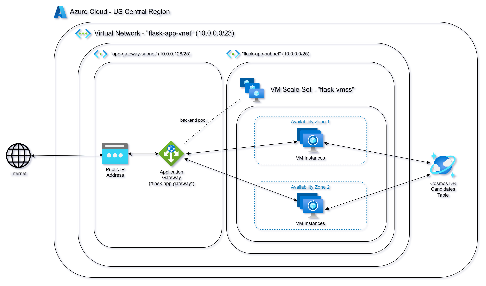
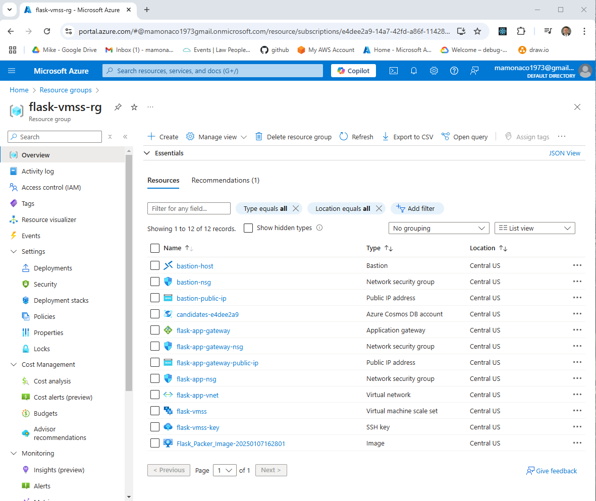

# Azure VM Scale Set (VMSS) Example

This is Part 2 of the Series: [Scaling in the Cloud: AWS Auto Scaling, Azure VMSS, and GCP MIGs](https://youtu.be/fogz73FXJEA).

## Introduction

In this video, we will demonstrate the deployment of Flask-based microservices within an **Azure Virtual Machine Scale Set (VMSS)** while covering the following tasks:

- **Deploy Flask-based microservices** on Azure VMs.
- **Utilize CosmosDB** as a document database to store microservice data.
- **Create a VM Image** of the deployed services using Packer.
- **Configure the Virtual Machine Scale Set** to enable automatic scalability using `Terraform`
- **Simulate load** to test scalability and trigger scaling events.
- **Clean up resources** by decommissioning all infrastructure provisioned during the process.



## Prerequisites

* [An Azure Account](https://portal.azure.com/)
* [Install AZ CLI](https://learn.microsoft.com/en-us/cli/azure/install-azure-cli) 
* [Install Latest Terraform](https://developer.hashicorp.com/terraform/install)
* [Install Latest Packer](https://developer.hashicorp.com/packer/install)

If this is your first time watching our content, we recommend starting with this video: [Azure + Terraform: Easy Setup](https://www.youtube.com/watch?v=wwi3kVgYNOk). It provides a step-by-step guide to properly configure Terraform, Packer, and the AZ CLI.

## Download this Repository

```bash
git clone https://github.com/mamonaco1973/azure-flask-vmss.git
cd azure-flask-vmss
```

## Build the Code

Run [check_env](build\check_env.sh) then run [apply](apply.sh).

```bash
~/azure-flask-vmss$ ./apply.sh
NOTE: Validating that required commands are found in your PATH.
NOTE: az is found in the current PATH.
NOTE: packer is found in the current PATH.
NOTE: terraform is found in the current PATH.
NOTE: All required commands are available.
NOTE: Validating that required environment variables are set.
NOTE: ARM_CLIENT_ID is set.
NOTE: ARM_CLIENT_SECRET is set.
NOTE: ARM_SUBSCRIPTION_ID is set.
NOTE: ARM_TENANT_ID is set.
NOTE: All required environment variables are set.
NOTE: Logging in to Azure using Service Principal...
NOTE: Successfully logged into Azure.
NOTE: Building infrastructure phase 1.
Initializing the backend...
Initializing provider plugins...
- Finding latest version of hashicorp/azurerm...
- Installing hashicorp/azurerm v4.14.0...
- Installed hashicorp/azurerm v4.14.0 (signed by HashiCorp)
Terraform has created a lock file .terraform.lock.hcl to record the provider
selections it made above. Include this file in your version control repository
so that Terraform can guarantee to make the same selections by default when
you run "terraform init" in the future.

Terraform has been successfully initialized!
[...]
```

### Build Process Overview

The build process is divided into three phases:

1. **Phase 1:** Configure the network and create the project resource group.
2. **Phase 2:** Build the Flask services into a VM image using Packer and place the image in the resource group created in Phase 1.
3. **Phase 3:** Create the VM Scale Set (VMSS) configuration using the image from Phase 2 and define the scaling policy.

## Tour of Build Output in the Azure Console



## Test the Services

We will test the services with [Postman](https://www.postman.com/downloads/). First run [validate.sh](validate.sh) to get the base URL for the build.

```bash
~/azure-flask-vmss$ ./validate.sh
NOTE: Waiting for at least one healthy backend server...
NOTE: At least one healthy backend server found!
NOTE: Health check endpoint is http://flask-app-vmss-e4dee2.centralus.cloudapp.azure.com/gtg?details=true
✓ good to go passed
✓ insert passed
✓ verification passed
✓ candidate list passed
```

Copy the value from validate `http://flask-alb-1771338256.us-east-2.elb.amazonaws.com/gtg?details=true` and paste into Postman.


### HTTP Endpoint Summary

#### `/gtg` (GET)
- **Purpose**: Health check.
- **Response**: 
  - `{"connected": "true", "instance-id": <instance_id>}` (if `details` query parameter is provided).
  - 200 OK with no body otherwise.

#### `/candidate/<name>` (GET)
- **Purpose**: Retrieve a candidate by name.
- **Response**: 
  - Candidate details (JSON) with status `200`.
  - `"Not Found"` with status `404` if no candidate is found.

#### `/candidate/<name>` (POST)
- **Purpose**: Add or update a candidate by name.
- **Response**: 
  - `{"CandidateName": <name>}` with status `200`.
  - `"Unable to update"` with status `500` on failure.

#### `/candidates` (GET)
- **Purpose**: Retrieve all candidates.
- **Response**: 
  - List of candidates (JSON) with status `200`.
  - `"Not Found"` with status `404` if no candidates exist.

## Simulate Load

We will access the VM instances and execute the `stress` command to simulate a high CPU load. This process will demonstrate the system's ability to dynamically scale up by adding VM instances in response to increased CPU utilization and subsequently scale down by removing nodes as the load decreases


### Capacity Configuration

| **Parameter** | **Value**                                | **Description**                                 |
|---------------|------------------------------------------|-------------------------------------------------|
| Minimum       | `2`         | Minimum number of instances in the VMSS.       |
| Default       | `2`            | Default number of instances in the VMSS.       |
| Maximum       | `4`                                     | Maximum number of instances in the VMSS.       |

### Scaling Rules

#### Scale-Up Rule
- Triggered when CPU usage exceeds a specified threshold.
- **Trigger Conditions**:
  - **Metric Name**: `Percentage CPU`
  - **Operator**: `GreaterThan`
  - **Threshold**: `60` (Percentage CPU)
  - **Statistic**: `Average`
  - **Time Grain**: `1 minute`
  - **Time Window**: `1 minute`
  - **Time Aggregation**: `Average`
- **Scale Action**:
  - **Direction**: Increase
  - **Type**: `ChangeCount` (Adjust by a fixed count)
  - **Value**: `1` (Add one instance)
  - **Cooldown Period**: `1 minute`

#### Scale-Down Rule
- Triggered when CPU usage falls below a specified threshold.
- **Trigger Conditions**:
  - **Metric Name**: `Percentage CPU`
  - **Operator**: `LessThan`
  - **Threshold**: `60` (Percentage CPU)
  - **Statistic**: `Average`
  - **Time Grain**: `5 minutes`
  - **Time Window**: `5 minutes`
  - **Time Aggregation**: `Average`
- **Scale Action**:
  - **Direction**: Decrease
  - **Type**: `ChangeCount` (Adjust by a fixed count)
  - **Value**: `1` (Remove one instance)
  - **Cooldown Period**: `1 minute`

### Key Features
- **Dynamic Scaling**: The scaling policy dynamically adjusts the number of instances in the VM Scale Set based on CPU utilization.
- **Efficient Resource Utilization**: Instances are added when CPU usage is high and removed when demand decreases.
- **Quick Response Time**: The cooldown period ensures scaling actions are executed quickly after the conditions are met.

## Run the "destroy" script when you are done

```bash
~/azure-flask-vmss$ ./destroy.sh
NOTE: Deleting the VMSS.
NOTE: Using the latest image (Flask_Packer_Image-20250107162801) in flask-app-vmss
Initializing the backend...
Initializing provider plugins...
- Reusing previous version of hashicorp/azurerm from the dependency lock file
- Using previously-installed hashicorp/azurerm v4.14.0

Terraform has been successfully initialized!

[...]
```
